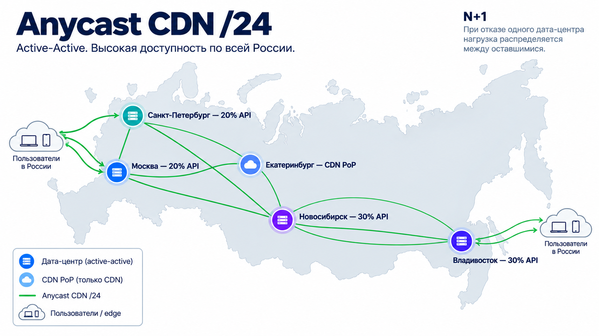
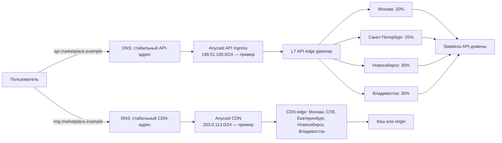

# tp_highload_2026
Курсовая работа по курсу "Проектирование высоконагруженных систем" VK технопарк

## 1. Тема и целевая аудитория
### Тип сервиса
Высоконагруженный маркетплейс (на примере сервиса ozon)

### Функционал mvp
1. Регистрация и авторизация пользователей
2. Просмотр главной страницы с персонализированной лентой рекомендаций
3. Просмотр каталога товаров
4. Поиск и просмотр карточки товара
5. Добавление и изменение товаров в корзине
6. Выбор ПВЗ и оформление заказа
7. Просмотр и добавление рейтинга товаров и отзывов

### Ключевые продуктовые решения
1. Главная страница формируется персонально для пользователя на основе рекомендательной системы.
2. Рейтинг товара рассчитывается на основе оценок пользователей и отображается вместе с отзывами.
3. Покупатель может оставить отзыв на товар только после покупки

### Целевая аудитория
По данным ozon 84 млн пользователей в месяц.[[1]](#source1) География распределения пользователя такова: ~94.7% пользователей из РФ, остальные 5% пользователей из-за рубежа. Средний трафик из стран зарубежья не превышает 1% на страну.[[2]](#source2)

В РФ около 27% приходится на Московскую область, Москву и СПБ.[[3]](#source3)

Причем с мобильных устройств кол-во транзакционных запросов е-ком 79% против 37% на десктопе.[[4]](#source4)

## 2. Расчет нагрузки
### Аудиторные метрики

| Метрика |                            Значение |
|---------|------------------------------------:|
| MAU     |               84 млн[[1]](#source1) |
| DAU     | 44 млн[[5]](#source5) |

### Расчет среднего количества действий пользователя в день

##### Регистрация 
По данным Ozon, на конец I квартала 2026 года база активных покупателей составила 67,3 млн человек, увеличившись на 16% год к году [[5]](#source5). Число активных покупателей годом ранее составляло 58,02 млн. Значит годовой прирост 9,28 млн покупателей. Пусть 85% данного прироста приходится на новых зарегистрированных пользователей. Тогда оценочное количество регистраций в сутки составляет 9,28 млн * 0,85 / 365 = 21 610. При DAU = 44 млн среднее количество регистраций на одного пользователя в сутки составляет 21 610 / 44 000 000 ≈ 0,00049.

##### Авторизация
Примем, что срок жизни пользовательской сессии составляет 30 дней. Предполагая, что пользователи посещают сервис ежедневно и повторно авторизуются после истечения срока сессии, получим среднее количество авторизаций 1/30 = 0,033.

##### Просмотр главной страницы с персонализированной лентой рекомендаций
Нет статистики, примем, что каждый пользователь дневной аудитории, независимо от авторизации, просматривает персонализированную ленту в среднем 2 раза в сутки. Страница рекомендаций доступна всем пользователям, поэтому среднее количество её просмотров на одного пользователя DAU составляет **2** просмотра в сутки.

##### Скролл ленты рекомендаций на главной странице
При первом открытии главной страницы загружается 24 карточки товаров. В среднем пользователь выполняет 2 скролла; каждый скролл подгружает ещё 12 карточек и формирует отдельный запрос к сервису рекомендаций. При 2 просмотрах главной в сутки среднее количество запросов подгрузки ленты на пользователя составляет 2 * 2 = **4** в сутки.

##### Просмотр каталога товаров
В связи с отсутствием публичной статистики примем допущение, что пользователь посещает сервис 2 раза в сутки, в 60% сессий открывает каталог и просматривает в среднем 2 страницы. Каталог доступен как авторизованным, так и неавторизованным пользователям, поэтому расчёт ведётся по всей дневной аудитории (DAU), без разделения пользователей по статусу авторизации. Среднее количество просмотров каталога на одного пользователя в сутки составляет 2 × 0,6 × 2 = **2,4**.

##### Поиск товаров
В связи с отсутствием публичной статистики примем допущение, что пользователь посещает сервис 2 раза в сутки, в 60% сессий использует поиск и выполняет в среднем 2 поисковых запроса. Поиск доступен как авторизованным, так и неавторизованным пользователям. Среднее количество поисковых запросов на одного пользователя в сутки составляет 2 * 0,6 * 2 = 2,4.

##### Просмотр карточки товара
В связи с отсутствием публичной статистики примем допущение, что пользователь посещает сервис 2 раза в сутки, в 75% сессий просматривает карточки товаров и открывает в среднем 4 карточки за такую сессию. Среднее количество просмотров карточек товаров на одного пользователя в сутки составляет 2 * 0,75 * 4 = 6.

##### Добавление товара в корзину
Пусть 20% дневной аудитории добавляют товары в корзину и каждый из них выполняет в среднем 2 добавления в сутки. Среднее количество добавлений товара в корзину на одного пользователя составляет 0,2 * 2 = 0,4.

##### Изменение корзины
пусть 10% дневной аудитории изменяют содержимое корзины и каждый из них выполняет в среднем 2 изменения в сутки. Среднее количество изменений корзины на одного пользователя составляет 0,1 * 2 = 0,2.

##### Выбор ПВЗ
пусть 15% дневной аудитории выбирают ПВЗ и каждый из них выполняет это действие в среднем 1 раз в сутки. Среднее количество выборов ПВЗ на одного пользователя составляет 0,15 * 1 = 0,15.

##### Оформление заказа
По данным Ozon за II квартал 2025 года, количество активных покупателей превысило 60 млн, а частотность покупок составила 30 заказов в год. Для оценки примем 60 млн покупателей. Тогда количество заказов в сутки составляет 60 млн * 30 / 365 ≈ 4,93 млн. При DAU = 44 млн среднее количество оформлений заказа на одного пользователя составляет 4,93 / 44 ≈ 0,112 в сутки. Оценка предполагает равномерное распределение заказов и требует сопоставимости периодов исходных показателей.

##### Просмотр рейтинга и отзывов
В связи с отсутствием публичной статистики примем допущение, что 40% дневной аудитории просматривают рейтинги и отзывы товаров и каждый из них выполняет в среднем 3 просмотра в сутки. Среднее количество просмотров рейтингов и отзывов на одного пользователя составляет 0,4 * 3 = 1,2.

##### Добавление рейтинга и отзыва
пусть покупатели оставляют рейтинг и отзыв для 5% оформленных заказов. При среднем количестве заказов 0,112 на пользователя в сутки получаем 0,112 * 0,05 = 0,0056 отзыва на одного пользователя в сутки. Предполагается, что один заказ соответствует одному оцениваемому товару; при нескольких товарах в заказе показатель необходимо пересчитать.

| Действие                                                            | Среднее количество действий пользователя в день |
|---------------------------------------------------------------------|------------------------------------------------:|
| Регистрация                                                         |                                         0,00049 |
| Авторизация                                                         |                                           0,033 |
| Просмотр главной страницы с персонализированной лентой рекомендаций |                                               2 |
| Скролл ленты рекомендаций на главной странице                       |                                               4 |
| Просмотр каталога товаров                                           |                                             2,4 |
| Поиск товаров                                                       |                                             2,4 |
| Просмотр карточки товара                                            |                                               6 |
| Добавление товара в корзину                                         |                                             0,4 |
| Изменение корзины                                                   |                                             0,2 |
| Выбор ПВЗ                                                           |                                            0,15 |
| Оформление заказа                                                   |                                           0,112 |
| Просмотр рейтинга и отзывов                                         |                                             1,2 |
| Добавление рейтинга и отзыва                                        |                                          0,0056 |

### Средний размер хранилища пользователя
Для оценки среднего объёма пользовательских данных примем следующие допущения. По условию расчёта размер данных на одного пользователя увеличивается втрое, поэтому размеры каждого пользовательского объекта также умножаются на 3:

- Профиль пользователя занимает в среднем 6 КБ.
- В корзине пользователя хранится в среднем 5 товаров. Один элемент корзины занимает 600 Б.
- Средняя частота покупок составляет 30 заказов в год.
- История заказов хранится за расчётный период 4,2 года. Среднее количество заказов на пользователя составляет 30 * 4,2 = 126 шт.
- Средний размер одного заказа составляет 6 КБ.
- Пользователи оставляют отзывы для 5% заказов. Среднее количество отзывов составляет 126 * 0,05 = 6,3 шт.
- Средний размер одного отзыва составляет 3 КБ.

Все значения размеров объектов и периода хранения являются допущениями для расчёта нагрузки.

| Тип данных        | Среднее количество, шт. | Размер объекта | Объём, ГБ |
|-------------------|------------------------:|---------------:|----------:|
| Профиль           |                       1 |           6 КБ |  0,000006 |
| Товары в корзине  |                       5 |          600 Б |  0,000003 |
| Заказы            |                     126 |           6 КБ |  0,000756 |
| Рейтинги и отзывы |                     6,3 |           3 КБ | 0,0000189 |
| Итого             |                   138,3 |              — | 0,0007839 |

### Размер хранения в разбивке по типам данных

##### Данные пользователей

По данным Ozon, на конец I квартала 2026 года количество активных покупателей составило 67,3 млн [[5]](#source5).

Рассчитаем объём по каждому типу данных:

- Профили: 67,3 млн * 6 КБ = 0,4038 ТБ.
- Корзины: 67,3 млн * 5 * 600 Б = 0,2019 ТБ.
- Заказы: 67,3 млн * 126 * 6 КБ = 50,8788 ТБ.
- Отзывы: 67,3 млн * 6,3 * 3 КБ = 1,272 ТБ.

Общий объём пользовательских данных составляет:

0,4038 + 0,2019 + 50,8788 + 1,272 = 52,76 ТБ.

##### Каталог товаров

В связи с отсутствием подтверждённых данных о количестве товарных карточек, что каталог содержит 200 млн товаров. Средний размер данных одной карточки составляет 4 КБ.

Общий объём каталога:

200 млн * 4 КБ = **0,8 ТБ**.

##### Изображения товаров

Примем допущение, что каждый товар содержит в среднем 3 изображения размером 200 КБ каждое. Все три изображения загружаются сразу при показе товарной карточки в ленте, каталоге, поиске и на странице товара.

Количество изображений:

200 млн * 3 = 600 млн шт.

Общий объём изображений:

600 млн * 200 КБ = **120 ТБ**.

##### Сводная таблица

| Тип данных          | Количество, шт. | Размер объекта | Общий объём, ТБ |
|---------------------|----------------:|---------------:|----------------:|
| Профили             |        67,3 млн |           6 КБ |          0,4038 |
| Элементы корзин     |       336,5 млн |          600 Б |          0,2019 |
| Заказы              |       8,48 млрд |           6 КБ |         50,8788 |
| Отзывы              |      423,99 млн |           3 КБ |           1,272 |
| Карточки товаров    |         200 млн |           4 КБ |             0,8 |
| Изображения товаров |         600 млн |         200 КБ |             120 |
| **Итого**           |               — |              — |      **173,56** |

Общий расчётный объём хранилища составляет **173,56 ТБ**.

### Расчёт RPS

Для расчёта среднего количества запросов в секунду используем DAU = 44 млн пользователей и ранее рассчитанное среднее количество действий пользователя в сутки. Одному пользовательскому действию соответствует один запрос; исключение — просмотр главной, при котором первоначальная загрузка и каждый скролл ленты являются отдельными запросами.

Средний RPS рассчитывается по формуле:

RPS_avg = DAU * ActionsPerDAU / 86400

Для расчёта пикового RPS примем коэффициент пиковости K = 5, предполагая, что максимальная интенсивность запросов в течение суток в 5 раз превышает среднюю.

RPS_peak = RPS_avg * 5

Например, для просмотра карточки товара:

RPS_avg = 44 000 000 * 6 / 86400 ≈ 3056

RPS_peak = 3056 * 5 = 15278

#### Сводная таблица RPS

| Тип запроса                            | Средний RPS | Пиковый RPS |
|----------------------------------------|------------:|------------:|
| Регистрация                            |        0,25 |        1,25 |
| Авторизация                            |       16,81 |       84,03 |
| Первоначальная загрузка главной        |     1018,52 |     5092,59 |
| Скролл ленты рекомендаций              |     2037,04 |    10185,19 |
| Каталог товаров                        |     1222,22 |     6111,11 |
| Поиск товаров                          |     1222,22 |     6111,11 |
| Карточка товара                        |     3055,56 |    15277,78 |
| Добавление в корзину                   |      203,70 |     1018,52 |
| Изменение корзины                      |      101,85 |      509,26 |
| Выбор ПВЗ                              |       76,39 |      381,94 |
| Оформление заказа                      |       57,04 |      285,19 |
| Просмотр рейтинга и отзывов            |      611,11 |     3055,56 |
| Добавление рейтинга и отзыва           |        2,85 |       14,26 |
| **Итого**                              | **9625,56** | **48127,80** |

Запросы выдачи рекомендаций при скролле учтены отдельно. Загрузка изображений учитывается в расчёте сетевого трафика через CDN.

Проверка тенденции: после пересчёта карточка товара остаётся лидером по RPS (15 277,78 пиковых RPS против 9 166,67 ранее). Следующим по нагрузке становится отдельный запрос скролла ленты рекомендаций (10 185,19 пиковых RPS); это ожидаемое следствие учёта пагинации и не меняет лидирующий endpoint.

### 3. Расчёт сетевого трафика

Для расчёта пикового сетевого трафика используем ранее полученные значения пикового RPS. В связи с отсутствием публичной статистики о размерах ответов API Ozon примем средние размеры ответов как допущения.

Пиковый трафик рассчитаем по формуле:

Traffic_peak = RPS_peak * Size_response * 8 / 10^9

где Size_response — размер ответа в байтах.

#### API-трафик

| Тип запроса | Пиковый RPS | Размер ответа | Трафик, Гбит/с |
|---|---:|---:|---:|
| Первоначальная загрузка главной (24 карточки) | 5093 | 30 КБ | 1,222 |
| Скролл ленты главной (12 карточек) | 10185 | 15 КБ | 1,222 |
| Каталог товаров | 6111 | 25 КБ | 1,222 |
| Поиск товаров | 6111 | 20 КБ | 0,978 |
| Карточка товара | 15278 | 15 КБ | 1,833 |
| Просмотр отзывов | 3056 | 10 КБ | 0,244 |
| Выбор ПВЗ | 382 | 10 КБ | 0,031 |
| Остальные запросы | ≈1913 | 2 КБ | 0,031 |
| **Итого** | | | **≈6,78** |

#### Изображения товаров

Изображения загружаются при просмотре главной страницы, каталога, результатов поиска и карточек товаров. В каждой товарной карточке загружаются сразу 3 изображения.

Примем следующие допущения:

- Средний размер изображения составляет 200 КБ.
- На первоначальной выдаче главной загружается 24 * 3 = 72 изображения; при каждом скролле — 12 * 3 = 36 изображений.
- В каталоге и поиске сохраняется исходное число товарных карточек в выдаче: соответственно 8 * 3 = 24 и 6 * 3 = 18 изображений.
- Благодаря кешированию на стороне клиента и повторному использованию изображений 50% потенциальных загрузок не требуют повторной передачи.
- Изображения доставляются пользователям через CDN.

Пиковый трафик изображений рассчитывается по формуле:

Traffic_images = RPS_peak * N_images * Size_image * 0,5 * 8 / 10^9

| Тип страницы / запроса                         | Пиковый RPS | Изображений на страницу | Трафик, Гбит/с |
|------------------------------------------------|------------:|------------------------:|---------------:|
| Первоначальная загрузка главной (24 карточки)  |        5093 |                      72 |         293,33 |
| Скролл ленты главной (12 карточек)             |       10185 |                      36 |         293,33 |
| Каталог                                        |        6111 |                      24 |         117,33 |
| Поиск                                          |        6111 |                      18 |          88,00 |
| Карточка товара                                |       15278 |                       3 |          36,67 |
| **Итого**                                      |           — |                       — |     **828,66** |

Таким образом, пиковый трафик изображений от CDN к пользователям составляет приблизительно 828,66 Гбит/с.

Предположим, что 80% оставшихся запросов к изображениям обслуживаются из кеша CDN.

Тогда пиковый трафик от исходного хранилища изображений к CDN составляет:

Traffic_origin = 828,66 × 0,2 = 165,73 Гбит/с.

#### Сводная таблица сетевого трафика

| Тип трафика                 | Пиковый трафик, Гбит/с |
|-----------------------------|-----------------------:|
| API → пользователи          |                   6,78 |
| CDN → пользователи          |                 828,66 |
| **Итого к пользователям**   |             **835,44** |
| Хранилище изображений → CDN |                 165,73 |

Суммарный пиковый исходящий трафик системы к пользователям составляет приблизительно 835,44 Гбит/с.

Дополнительно необходимо учитывать трафик между хранилищем изображений и CDN — 165,73 Гбит/с. Он не прибавляется к пользовательскому трафику, чтобы избежать двойного учёта.

## 4. Глобальная балансировка нагрузки

### Размещение дата-центров

Для API выберем четыре независимых дата-центра: Москва, Санкт-Петербург, Новосибирск и Владивосток. В Екатеринбурге разместим отдельный **Anycast CDN PoP**: он кеширует и отдаёт изображения, но не исполняет транзакционные API-запросы.

Выбор площадок опирается на географию целевой аудитории из раздела 1:

- **94,7% аудитории находится в РФ** [[2]](#source2), поэтому основная инфраструктура размещается в России. Это сокращает сетевую задержку для подавляющей части покупателей и уменьшает зависимость от международных каналов.
- **27% аудитории приходится на Москву, Московскую область и Санкт-Петербург** [[3]](#source3). Две независимые площадки в этом макрорегионе обслуживают крупнейшую подтверждённую концентрацию пользователей. Это улучшает p95 latency для главной страницы, поиска, каталога, карточки товара и checkout.
- Остальные **67,7% пользователей из РФ** распределены вне Москвы, МО и Санкт-Петербурга. Направлять весь этот поток в один Новосибирск было бы ошибкой: в расчётной модели восточное направление составляет 60% API-трафика. Поэтому оно разделяется между Новосибирском и Владивостоком — по 30% на каждый ДЦ. Екатеринбург дополнительно приближает CDN к пользователям Урала.
- Зарубежная аудитория составляет 5,3%, причём ни одна страна не даёт более 1% трафика [[2]](#source2). На текущем масштабе отдельный зарубежный ДЦ не окупается: изображения для этой аудитории доставляет Anycast CDN, а API попадает на ближайший доступный российский API edge и затем в здоровый core ДЦ.

Размещение влияет на продуктовые метрики следующим образом:

- меньшая задержка выдачи и изображений снижает время загрузки страницы и вероятность ухода пользователя до добавления товара в корзину;
- меньшая задержка на оформлении заказа повышает вероятность успешного завершения checkout;
- независимые площадки и резервирование нагрузки снижают вероятность недоступности сервиса и потери заказов при отказе одного ДЦ.

### Почему четыре ДЦ и отдельный CDN PoP

Один ДЦ был бы единой точкой отказа. Три ДЦ в этой географии привели бы к перекосу: Новосибирск принимал бы около 60% потока из восточных регионов, а при его отказе двум западным площадкам пришлось бы резко принять этот трафик. Четыре core ДЦ делят поток на **20% / 20% / 30% / 30%**: разница между наиболее и наименее загруженной площадкой составляет только 10 п.п., а не 40 п.п.

Екатеринбург не становится пятым core ДЦ, поскольку 828,66 Гбит/с из 835,44 Гбит/с пользовательского трафика приходится на изображения CDN. Для Урала наибольший продуктовый эффект даёт близкий edge-кеш; API-трафик составляет лишь 6,78 Гбит/с и обслуживается четырьмя core ДЦ. Функциональные домены сервиса — edge/CDN, API gateway, каталог и поиск, рекомендации, профили, корзина, заказы/checkout и отзывы. Каждый API-домен развёрнут во всех четырёх ДЦ; ни один бизнес-домен не закреплён за единственной площадкой. Вопросы репликации и консистентности stateful-хранилищ рассматриваются отдельно в разделе проектирования данных.

### Распределение API-нагрузки по ДЦ

В штатном режиме L7 API edge поддерживает целевое распределение **20% / 20% / 30% / 30%**: Москва — 20%, Санкт-Петербург — 20%, Новосибирск — 30%, Владивосток — 30%. Так восточный трафик не концентрируется в Новосибирске. Решение о выборе core ДЦ принимает управляемый балансировщик по health checks и доступной ёмкости, а не DNS-кеш пользователя.

| Тип запроса | Пиковый RPS всего | Москва / СПб: по 20% | Новосибирск / Владивосток: по 30% |
|---|---:|---:|---:|
| Регистрация | 1,25 | 0,25 | 0,38 |
| Авторизация | 84,03 | 16,81 | 25,21 |
| Первоначальная загрузка главной | 5 092,59 | 1 018,52 | 1 527,78 |
| Скролл ленты рекомендаций | 10 185,19 | 2 037,04 | 3 055,56 |
| Каталог товаров | 6 111,11 | 1 222,22 | 1 833,33 |
| Поиск товаров | 6 111,11 | 1 222,22 | 1 833,33 |
| Карточка товара | 15 277,78 | 3 055,56 | 4 583,33 |
| Добавление в корзину | 1 018,52 | 203,70 | 305,56 |
| Изменение корзины | 509,26 | 101,85 | 152,78 |
| Выбор ПВЗ | 381,94 | 76,39 | 114,58 |
| Оформление заказа | 285,19 | 57,04 | 85,56 |
| Просмотр рейтинга и отзывов | 3 055,56 | 611,11 | 916,67 |
| Добавление рейтинга и отзыва | 14,26 | 2,85 | 4,28 |
| **Итого на один ДЦ** | **48 127,80** | **9 625,56** | **14 438,34** |

Средняя нагрузка составляет 1 925,11 RPS на Москву и Санкт-Петербург и 2 887,67 RPS на Новосибирск и Владивосток. Пиковая — 9 625,56 и 14 438,34 RPS соответственно.

| Сценарий отказа | Распределение на оставшихся ДЦ | Максимальная нагрузка на ДЦ |
|---|---|---:|
| Нет отказа | 20% / 20% / 30% / 30% | 14 438,34 peak RPS (30%) |
| Отказ Москвы или СПб | 26,67% / 36,67% / 36,67% | 17 646,86 peak RPS (36,67%) |
| Отказ Новосибирска или Владивостока | 30% / 30% / 40% | 19 251,12 peak RPS (40%) |

Москва и Санкт-Петербург резервируются минимум под 30% общего пика — **14 438,34 peak RPS** или 2,03 Гбит/с API-трафика каждая. Новосибирск и Владивосток резервируются минимум под 40% — **19 251,12 peak RPS** или 2,71 Гбит/с каждый. Нагрузка CDN не фиксируется по тем же долям: Anycast выбирает маршрут средствами BGP, поэтому утилизация CDN PoP контролируется телеметрией и BGP-политиками.

Последняя строка является целевым ориентиром, а не гарантией: Anycast выбирает маршрут средствами BGP, поэтому фактическое распределение CDN-трафика контролируется телеметрией и BGP-политиками.

### DNS, Anycast и регулирование трафика

- DNS не выполняет балансировку API: `api.marketplace.example` всегда возвращает стабильный Anycast API-адрес. Это исключает зависимость от географии recursive DNS, EDNS Client Subnet и времени жизни DNS-кеша. Указанный на схеме `198.51.100.0/24` — документационный пример выделенного Anycast-префикса API.
- Anycast API ingress анонсируется из четырёх core ДЦ. BGP приводит клиента к ближайшему живому API edge gateway; gateway завершает соединение и по актуальной конфигурации направляет каждый новый запрос в один из здоровых core ДЦ. Таким образом, Anycast применяется только для доставки до управляемого ingress, а не для выбора stateful backend.
- Для `img.marketplace.example` DNS аналогично возвращает стабильный Anycast CDN-адрес. Отдельный IPv4-префикс CDN `203.0.113.0/24` анонсируют edge в Москве, Санкт-Петербурге, Екатеринбурге, Новосибирске и Владивостоке; пользователь попадает на ближайшую по маршрутизации доступную площадку. Оба диапазона на схеме — документационные примеры, а не реальные сети сервиса.
- Global traffic manager проверяет `/health` каждого core ДЦ каждые 5 секунд. После двух последовательных неуспешных проверок он исключает ДЦ из конфигурации L7 API edge: при потере Москвы/СПб новые запросы получают веса 26,67% / 36,67% / 36,67%; при потере Новосибирска/Владивостока — 30% / 30% / 40%. Это изменение применяется на gateway и не ожидает истечения DNS-кеша. После восстановления вес возвращается постепенно, чтобы не вызвать всплеск нагрузки.
- При полном отказе API edge или CDN edge площадка withdraw'ит соответствующий BGP-анонс Anycast-префикса. Трафик автоматически выбирает один из оставшихся маршрутов. При перекосе CDN-трафика используются BGP communities и AS-path prepend, а также контроль утилизации каналов, cache hit ratio, p95 latency и error rate.

## Список источников
1. <a id="source1"> https://corp.ozon.ru/ru/sth/ozon-pokazyvaet-pribyl-chetvertyy-kvartal-podryad-5a3eed7d?__rr=3</a>
2. <a id="source2"> https://www.similarweb.com/ru/website/ozon.ru/#geography</a>
3. <a id="source3"> https://performance.ozon.ru/display/#auditory</a>
4. <a id="source4"> https://mediascope.net/upload/iblock/958/5sd52fq5leoqcf2a2h4bkv5v2hoa48n5/%D0%9D%D0%A0%D0%A4_Mediascope_ecom.pdf</a>
5. <a id="source5"> https://ir.ozon.com/ru/sth/f31836ed?__rr=3&abt_att=1</a>
